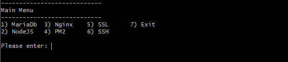

# IVM-VPS

Đây là script hỗ trợ cài đặt, thiết lập ứng dụng trên hệ điều hành Ubuntu để chạy ứng dụng quản lý invoice ( [ivm-app](https://github.com/sokhatvt/ivm-app) )

## Ứng dụng cần thiết
- `MariaDB` hệ quản trị cơ sở quản trị dữ liệu hoàn toàn miễn phí, phát triển từ mã nguồn gốc MySQL. Hệ quản trị cơ sở dữ liệu này được xem như lựa chọn thay thế hoàn hảo cho MySQL, bởi MariaDB sở hữu khả năng tương thích và hiệu suất hoạt động tốt hơn nhiều so với MySQL.
- `NodeJS` là một nền tảng (Platform) được xây dựng trên nền tảng Javascript V8 Engine. Được xây dựng để phát triển những ứng dụng server side.
## Ứng dụng hỗ trợ
- `PM2` hỗ trợ start, kill... và restart ứng dụng NodeJS mỗi khi bị lỗi giúp ứng dụng luôn luôn ONLINE.
- `NVM` hỗ trợ quản lý, cài đặt các version NodeJS. Trong dự án sử dụng vài cài đặt phiên bản v18.20.5.
- `NGINX` là một máy chủ web mã nguồn mở mạnh mẽ và được biết đến rộng rãi trong việc phục vụ các trang web qua giao thức HTTP.
- Và hỗ trợ cài đặt `SSL` miễn phí tự động làm mới khi hết hạn chứng chỉ.
## Cách sử dụng
Vào Terminal gõ:
```
bash <(curl -Ss https://raw.githubusercontent.com/sokhatvt/ivm-vps/refs/heads/master/main.sh)
```
